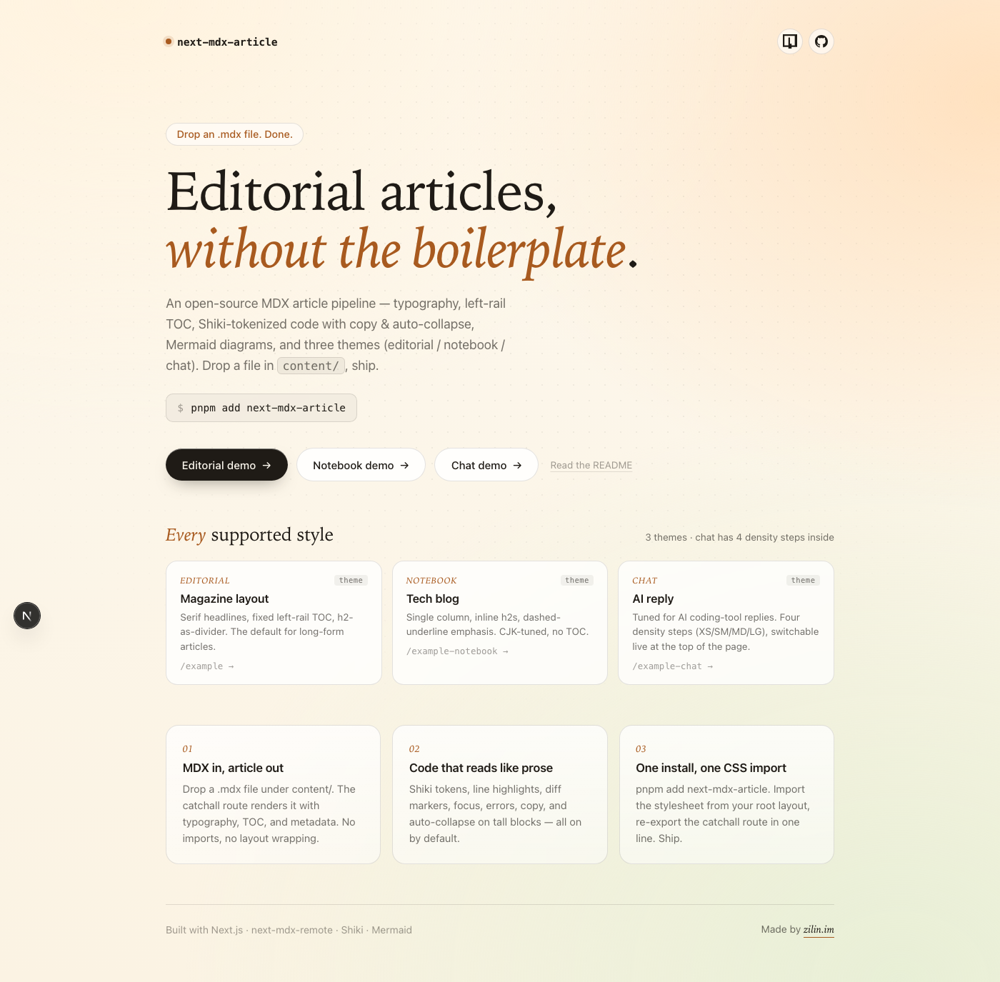
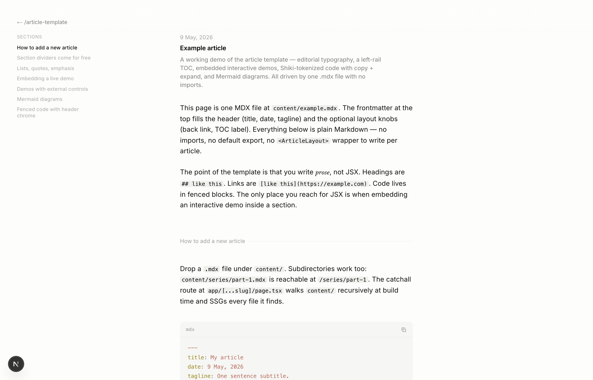

<div align="center">

# prose-atelier

**Drop an `.mdx` file. Get a fully styled long-form page in the voice you pick.**

A typography atelier for long-form content. Pick a theme
(editorial / notebook / chat — more coming), get Shiki code blocks,
Mermaid, left-rail TOC. One install, one CSS import, zero per-article
boilerplate. Next.js gets the zero-config path; Vite / Astro / Remix
/ any unified.js pipeline can opt into the framework-agnostic core.

[](https://www.npmjs.com/package/prose-atelier)
[](./LICENSE)
[](#)

<a href="./apps/template/hero.png">
  
</a>

</div>

---

## What this is

A small, opinionated MDX → article pipeline. Write `.mdx`, get a real
publication-quality page: title chrome, generated TOC, Shiki-tokenized code
with copy / diff / focus / collapse, Mermaid diagrams, three theme variants.

Built for Next.js App Router (the default zero-config path), but the
non-Next-coupled pieces — CSS, rehype plugins, framework-agnostic React —
also work standalone in Vite / Astro / Remix / any React or static
markdown pipeline. See [the three-tier consumer guide][pkg-readme].

Three themes you can switch per article via frontmatter:

| Theme | Designed for | Distinguishing trait |
|---|---|---|
| `editorial` (default) | Long-form English essays | Magazine layout, fixed left-rail TOC, h2-as-divider |
| `notebook` | CJK tech blog posts | Single column, inline h2, dashed-underline `<em>` |
| `chat` | AI coding-tool replies | Dense lists, 4-step density scale (xs/sm/md/lg), live density switcher |

## Quick start (Next.js)

```bash
pnpm add prose-atelier
```

**1.** Import the stylesheet from your root layout:

```tsx
// app/layout.tsx
import "prose-atelier/styles.css";
```

**2.** Wire the catchall route in one line:

```ts
// app/[...slug]/page.tsx
export { default, generateStaticParams, dynamicParams } from "prose-atelier/route";
```

**3.** Drop a file into `content/`:

```mdx
---
title: My first article
date: 2026 · 05 · 25
tagline: An optional subtitle.
---

Just write Markdown. Headings, code blocks, links, lists, the works.
```

Visit `/my-first-article`. Done.

**Need project-specific React components inside MDX?** Use the explicit
`createMdxRoute` form — see [the package README][pkg-readme].

## Demos

The repo ships a Next.js demo app under `apps/template/`. Run it locally:

```bash
pnpm install
pnpm dev
# open http://localhost:3090
```

Each route below is rendered from a single `.mdx` file:

| Route | Source | What it shows |
|---|---|---|
| [`/`](./apps/template/app/page.tsx) | `app/page.tsx` | The homepage you see in the hero shot |
| `/example` | [`content/example.mdx`](./apps/template/content/example.mdx) | Editorial theme. Every primitive: typography, TOC, Shiki transformers (highlight / diff / focus / error / collapse), Mermaid, interactive React demo |
| `/example-notebook` | [`content/example-notebook.mdx`](./apps/template/content/example-notebook.mdx) | Notebook theme. CJK-tuned, no TOC |
| `/example-chat` | [`content/example-chat.mdx`](./apps/template/content/example-chat.mdx) | Chat theme. Live XS/SM/MD/LG density switcher at the top |



## Not on Next.js?

The package's framework-agnostic surface works in any React environment
(Vite / Remix / TanStack Start / Astro with MDX), and the CSS + rehype
plugins work in any markdown pipeline (Astro / Vue / Svelte / static).

```ts
// CSS only — works literally anywhere
import "prose-atelier/styles.css";

// rehype plugins — drop into any unified.js pipeline
import rehypeShiki from "prose-atelier/rehype-shiki";
import rehypeCustomBlocks from "prose-atelier/rehype-custom-blocks";
import rehypeAddCopyContent from "prose-atelier/rehype-add-copy-content";

// React layout + components — framework-agnostic
import { ArticleLayoutBase, CodeBlock, articleMdxComponents } from "prose-atelier/core";
```

Full Vite / Astro / Vue examples are in the [package README][pkg-readme].

## Repo layout

This repo is a pnpm workspace with two packages:

```
.
├── packages/
│   └── prose-atelier/      ← the npm package (published)
│       ├── src/               ← React components + rehype plugins + CSS
│       └── README.md          ← API + frontmatter + non-Next.js usage guide
└── apps/
    └── template/              ← Next.js 16 demo app (private)
        ├── app/               ← homepage + catchall MDX route
        └── content/           ← example*.mdx
```

The demo app depends on the package via `"prose-atelier": "workspace:*"`,
so editing `packages/prose-atelier/src/` shows up in the demo as soon
as the package is rebuilt (or use `pnpm dev:pkg` for watch mode).

## Development

```bash
pnpm install         # install all workspace deps
pnpm build           # build the package (bunchee + CSS + rehype copy)
pnpm dev             # run the demo app at http://localhost:3090
pnpm dev:pkg         # watch-rebuild the package while editing it
pnpm pack:pkg        # produce a publishable tarball (inspect before publish)
pnpm publish:pkg     # publish to npm (bumps + builds, requires npm login)
```

## Documentation

- **[Package README](./packages/prose-atelier/README.md)** — full API, frontmatter reference, theme guide, non-Next.js usage. This is the npm-facing docs.
- **[Package DESIGN.md](./packages/prose-atelier/DESIGN.md)** — design rationale, module dependency graph, three-tier consumer model. Read before changing the API surface.
- **[Demo app README](./apps/template/README.md)** — how to run / extend the demo app.

## Contributing

PRs and issues welcome. The repo is small enough that there's no formal
contributing guide yet — open an issue if you're planning something
non-trivial so we can align before you write code.

A few ground rules baked into the codebase:

- **Types are the source of truth** — every public type lives in
  [`packages/prose-atelier/src/types.ts`](./packages/prose-atelier/src/types.ts) with doc-comments. Change them there first.
- **CSS variables for theming, not selectors** — visual tweaks should
  expose new `--art-*` / `--nb-*` / `--ch-*` variables rather than asking
  consumers to override selector cascades.
- **No new runtime deps without strong reason** — the bundle is small on
  purpose.

## License

[MIT](./LICENSE) © [zilin](https://zilin.im)

[pkg-readme]: ./packages/prose-atelier/README.md
