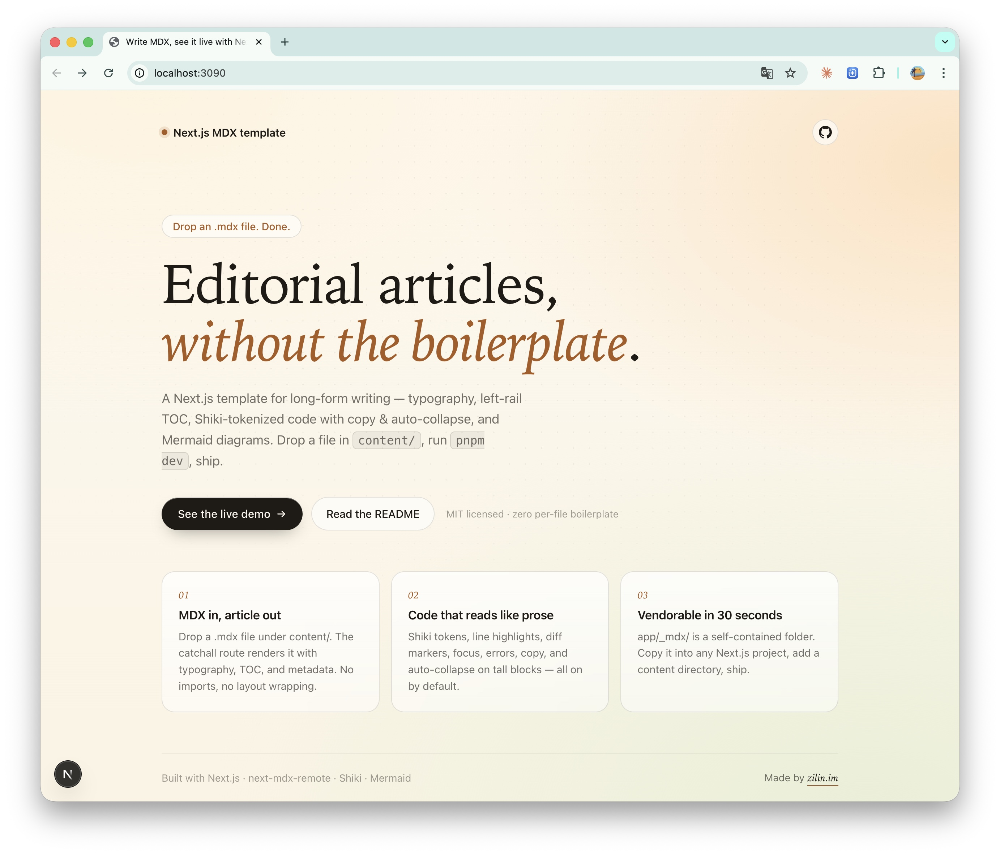
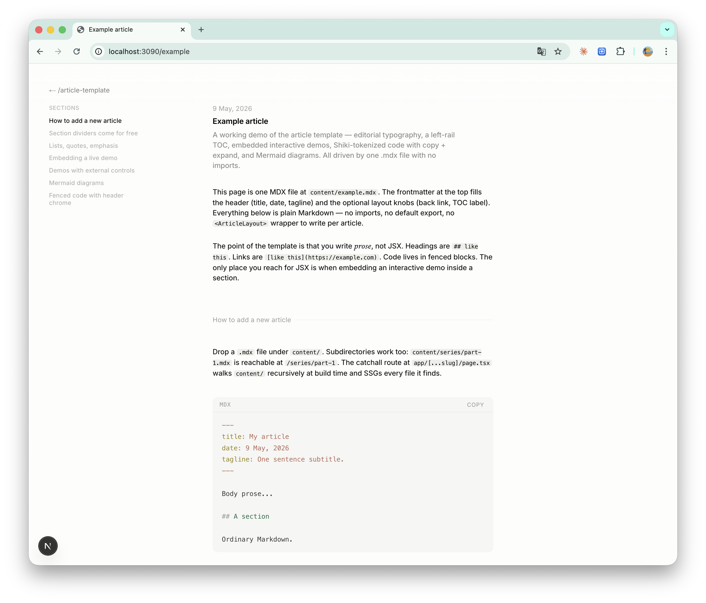

# article-template

<p align="center">
  
</p>

<p align="center">
  
</p>

A Next.js project where you drop a `.mdx` file in `content/`, run `pnpm dev`,
and get a fully-rendered editorial article — typography, left-rail TOC,
Shiki-tokenized code with copy + auto-collapse, Mermaid diagrams. No
boilerplate per file.

The reusable rendering pipeline lives in `app/_mdx/` as a single vendorable
folder; copy it into any new Next.js project and you get the same experience.

→ For the design rationale and implementation details, see [DESIGN.md](./DESIGN.md).

## Quick start

```bash
pnpm install
pnpm dev
```

Open <http://localhost:3090>. The index links to `/example`, which is rendered
from `content/example.mdx` and exercises every primitive (typography, lists,
demos, Shiki, Mermaid).

## Add an article

Drop a file under `content/`:

```bash
echo '---
title: My article
date: 9 May, 2026
tagline: One sentence subtitle.
---

# Body prose...

## A section heading
' > content/my-article.mdx
```

Visit `/my-article`. That's it — no imports, no `default export`, no
`<ArticleLayout>` wrapping.

Subdirectories work too: `content/series/part-1.mdx` → `/series/part-1`.

### Frontmatter shape

```yaml
title: My article             # required
date: 9 May, 2026             # optional, displayed above the title
tagline: One sentence subtitle.   # optional, plain text
back:                         # optional, defaults to { href: "/", label: "← back" }
  href: /
  label: ← /article-template
toc:                          # optional, defaults to { label: "Contents" }
  label: Sections
# toc: false                  # disables the TOC entirely
theme: editorial              # optional: "editorial" (default) | "notebook"
```

### Themes

Two visual styles ship in the template — pick per-article via `theme:` in
frontmatter:

| `theme: editorial` (default) | `theme: notebook` |
|---|---|
| Magazine layout. Fixed left-rail TOC. `##` headings render as a thin horizontal divider with a small floating label. `_em_` becomes serif italic. Best for English long-form essays. | Single-column tech-blog feel. No TOC. `##` headings are inline, `_em_` becomes a dashed underline (CJK-friendly), neutral grayscale palette. Best for Chinese / shorter posts. |
| Demo: [/example](./content/example.mdx) | Demo: [/example-notebook](./content/example-notebook.mdx) |

### Markdown features

| Feature | How |
|---|---|
| Headings | `## h2` becomes a section divider + TOC entry. `### h3` is a sub-heading (no line, not in TOC). |
| Lists / blockquote / em / strong | Plain Markdown. |
| Inline code | `` `code` `` |
| Code blocks | ` ```ts ` — Shiki tokens with header (lang label + copy) and auto-collapse on tall blocks. |
| Mermaid | ` ```mermaid ` — rendered client-side as SVG. |
| Custom React components | Reference by name (e.g. `<TickingDot />`); register in `app/[...slug]/page.tsx`. |

### Code block annotations

All Shiki transformers are on. Use them via comment markers in the code:

````md
```ts
const a = 1;
const b = 2; // [!code highlight]
const c = 3; // [!code ++]
const d = 4; // [!code --]
const e = 5; // [!code focus]
const f = 6; // [!code error]
const g = 7; // [!code warning]
const h = 8; // [!code word:hello]
```
````

Or via the meta string after the language:

````md
```ts {1,3-5}     # highlight lines 1, 3-5
```ts /word/      # highlight every "word"
````

## Add an interactive React component

Components must be registered in `app/[...slug]/page.tsx` (the runtime
model can't `import` from inside MDX). The simplest pattern: put the
component in `app/_demos/` and the catchall route picks it up via
`import * as demos from "@/app/_demos"`.

```tsx
// app/_demos/my-counter.tsx
"use client";
import { useState } from "react";

export function MyCounter() {
  const [n, setN] = useState(0);
  return <button onClick={() => setN(n + 1)}>{n}</button>;
}
```

```tsx
// app/_demos/index.tsx
export * from "./my-counter";
```

Then any `content/*.mdx` can use it by name:

```mdx
## A live demo

<MyCounter />
```

## Customize

Single-file knobs (the most common edits):

| Want to change | Edit |
|---|---|
| Shiki theme / transformers / language aliases | `app/_mdx/rehype-shiki.mjs` |
| Article colors / spacing / typography | `app/_mdx/article.css` (--art-* CSS variables) |
| Fonts | `app/_mdx/fonts.ts` |
| Code block chrome (header, copy, expand threshold) | `app/_mdx/code-block.tsx` |
| Mermaid theme | `app/_mdx/mermaid-block.tsx` |
| What components MDX files can use | `app/[...slug]/page.tsx` (extend `components`) |
| Where content lives | `app/[...slug]/page.tsx` (`CONTENT_DIR` constant) |

## Reuse in another Next.js project

`app/_mdx/` is a self-contained vendorable folder. Drop it into another
project + a catchall route + a content directory:

```bash
cp -r article-template/app/_mdx       new-project/app/_mdx
cp -r article-template/app/[...slug]  new-project/app/[...slug]
mkdir -p new-project/content

cd new-project
pnpm add next-mdx-remote rehype-slug \
  @shikijs/rehype @shikijs/transformers shiki \
  unist-util-visit mermaid
```

About 30 seconds. See `app/_mdx/README.md` for per-folder details and
`DESIGN.md` for the design rationale.

## Project layout

```
app/
├── _mdx/                 reusable MDX renderer — vendorable folder
├── _demos/               project-specific React components for use inside MDX
├── [...slug]/page.tsx    catchall route, walks content/ recursively, SSGs
├── layout.tsx            root <html> shell
├── page.tsx              project index (links to /example)
└── globals.css           page-level reset
content/
└── example.mdx           a working article exercising every primitive
DESIGN.md                 design + implementation walkthrough
README.md                 this file
```

## License

MIT — see [LICENSE](./LICENSE).
