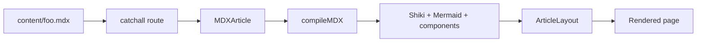

This page is one MDX file at `content/example.mdx`. The frontmatter at the top
fills the header (title, date, tagline) and the optional layout knobs (back
link, TOC label). Everything below is plain Markdown — no imports, no
default export, no `<ArticleLayout>` wrapper to write per article.

The point of the template is that you write *prose*, not JSX. Headings are
`## like this`. Links are `[like this](https://example.com)`. Code lives in
fenced blocks. The only place you reach for JSX is when embedding an
interactive demo inside a section.

## How to add a new article

Drop a `.mdx` file under `content/`. Subdirectories work too:
`content/series/part-1.mdx` is reachable at `/series/part-1`. The catchall
route at `app/[...slug]/page.tsx` walks `content/` recursively at build time
and SSGs every file it finds.

```mdx
---
title: My article
date: 9 May, 2026
tagline: One sentence subtitle.
---

Body prose...

## A section

Ordinary Markdown.
```

That's the entire boilerplate. No `import { ArticleLayout }`, no
`export default`. The runtime renderer inside `prose-atelier` handles
the shell, plugins, and component registration in one place.

### Optional layout knobs (all in frontmatter)

```yaml
back:
  href: /
  label: ← /article-template
toc:
  label: Sections        # default is "Contents"
# toc: false             # disables the TOC entirely
```

## Section dividers come for free

Every `## h2` becomes a horizontal divider with the heading text inlined on
the line, *and* an entry in the left TOC sidebar. Active-section tracking is
handled by an IntersectionObserver in `article-toc.tsx`, so it just works as
you scroll. Nothing to register.

The TOC is hidden under 1100px. The article column stays centered at all
widths.

### h3 sub-headings

`### Like this` rendered without a horizontal line — they live inside an h2
section as a quieter break. h3s do not appear in the TOC.

## Lists, quotes, emphasis

The body styles cover everything you'd expect from Markdown prose. Unordered
lists:

- **Bullet** — bold runs in the same color as body text but a heavier weight.
- *Italics* are rendered in the serif italic (`Newsreader`), one notch larger
  than the surrounding sans, with a slight color bump. Used for emphasis the
  way an editor would.
- Inline `code` lives in a soft gray pill so it doesn't fight with the prose.

Ordered lists work the same:

1. First.
2. Second, with a `code-snippet`.
3. Third, with [an external link](https://example.com).

Block quotes pick up the serif italic too:

> Typography is the design with which the medium of the printed word lives.
> Look at it from the writer's side: nobody wants their words to scream.

The whole prose color is `#111`, not gray. Soft gray is reserved for
metadata: the date in the header, the section labels on the dividers, the
caption text under demos.

## Embedding a live demo

The `<Demo>` primitive wraps your component in a dark (or light) card with a
caption underneath. The actual demo component (`<TickingDot />`) is
registered in `app/[...slug]/page.tsx` so MDX files can reference it by name
without any import statement:

<Demo
  theme="dark"
  caption={<><b>Ticking dot.</b> A trivially simple SVG that updates every animation frame, just so this section has something moving in it.</>}
  tag="rAF"
>
  <TickingDot />
</Demo>

## Demos with external controls

Sometimes a demo needs interactive controls that should sit *outside* the
dark frame — toggle chips, sliders, segmented controls. For that, skip
`<Demo>` and compose the lower-level primitives yourself. The component
renders its own `art-demo-frame` and the chips below it; the MDX wraps the
whole thing in `art-demo`:

<div className="art-demo">
  <SpeedDemo />
  <div className="art-demo-caption">
    <span><b>Speed control.</b> Click a chip to retime the dot. The chips sit
    outside the dark frame so they read as part of the page, not part of the
    demo.</span>
    <span className="art-demo-tag">controls</span>
  </div>
</div>

## Mermaid diagrams

Fenced ```` ```mermaid ```` blocks render client-side via the `mermaid`
library (dynamic-imported, so projects without diagrams pay zero kb). A
custom rehype plugin (`rehype-custom-blocks.mjs`) routes these blocks to
`<MermaidBlock>` instead of regular Shiki tokenization:



## Fenced code with header chrome

Each code block now ships with a header bar (language label + copy button)
and auto-collapses if it exceeds 480px:

```ts
import { ArticleLayout } from "prose-atelier";

export const meta = {
  title: "Hello",
  date: "1 Jan, 2026",
};
```

### Authoring annotations

All Shiki transformers are opt-in via comment markers in the code itself, or
via the meta string after the language. Diff:

```ts
const stable = "still here";
const removed = "going away"; // [!code --]
const added = "brand new"; // [!code ++]
```

Line highlight via the meta string:

```ts {2,4}
const a = 1;
const b = 2; // ← highlighted via {2,4}
const c = 3;
const d = 4; // ← highlighted via {2,4}
```

Word highlight, every occurrence of `useState` gets a soft yellow:

```tsx /useState/
import { useState } from "react";
function Counter() {
  const [n, setN] = useState(0);
  return <button onClick={() => setN(n + 1)}>{n}</button>;
}
```

Focus dims everything except the marked lines (hover the block to peek at
the dimmed lines):

```ts
function quickSort(arr) {
  if (arr.length <= 1) return arr;
  const pivot = arr[0]; // [!code focus]
  const left = arr.slice(1).filter((x) => x < pivot); // [!code focus]
  const right = arr.slice(1).filter((x) => x >= pivot); // [!code focus]
  return [...quickSort(left), pivot, ...quickSort(right)];
}
```

Error / warning level annotations get a soft red / amber strip:

```ts
fetch("/api/things")
  .then((r) => r.json())
  .then((data) => {
    console.log(data.naem); // [!code error] typo
    cache.set(KEY, data); // [!code warning] no TTL
  });
```

### Auto-collapse on tall blocks

Anything taller than 480px starts collapsed with an Expand toggle:

```ts
// Eight things you've definitely seen before, just to make this block tall.
function debounce(fn, wait) {
  let timer;
  return function debounced(...args) {
    clearTimeout(timer);
    timer = setTimeout(() => fn.apply(this, args), wait);
  };
}

function throttle(fn, wait) {
  let last = 0;
  return function throttled(...args) {
    const now = Date.now();
    if (now - last < wait) return;
    last = now;
    return fn.apply(this, args);
  };
}

function memoize(fn) {
  const cache = new Map();
  return function memoized(...args) {
    const key = JSON.stringify(args);
    if (!cache.has(key)) cache.set(key, fn.apply(this, args));
    return cache.get(key);
  };
}

function once(fn) {
  let called = false;
  let result;
  return function onced(...args) {
    if (called) return result;
    called = true;
    return (result = fn.apply(this, args));
  };
}

function compose(...fns) {
  return (x) => fns.reduceRight((acc, fn) => fn(acc), x);
}

function pipe(...fns) {
  return (x) => fns.reduce((acc, fn) => fn(acc), x);
}

function curry(fn, arity = fn.length) {
  return function curried(...args) {
    return args.length >= arity
      ? fn.apply(this, args)
      : curried.bind(this, ...args);
  };
}

function partial(fn, ...preset) {
  return function partialled(...rest) {
    return fn.apply(this, [...preset, ...rest]);
  };
}
```

To customize anything: see the `prose-atelier` README. The Shiki config
(themes, transformers, language aliases) is exposed via the
`prose-atelier/rehype-shiki` subpath — drop a custom rehype pipeline
into your MDX compile step and you're done.

---

That's it. Drop a `.mdx` in `content/` and you get the same shell. To copy
this setup to a fresh Next.js project: `pnpm add prose-atelier`, import
the stylesheet from your root layout, re-export the catchall route in one
line. About 30 seconds of work.
